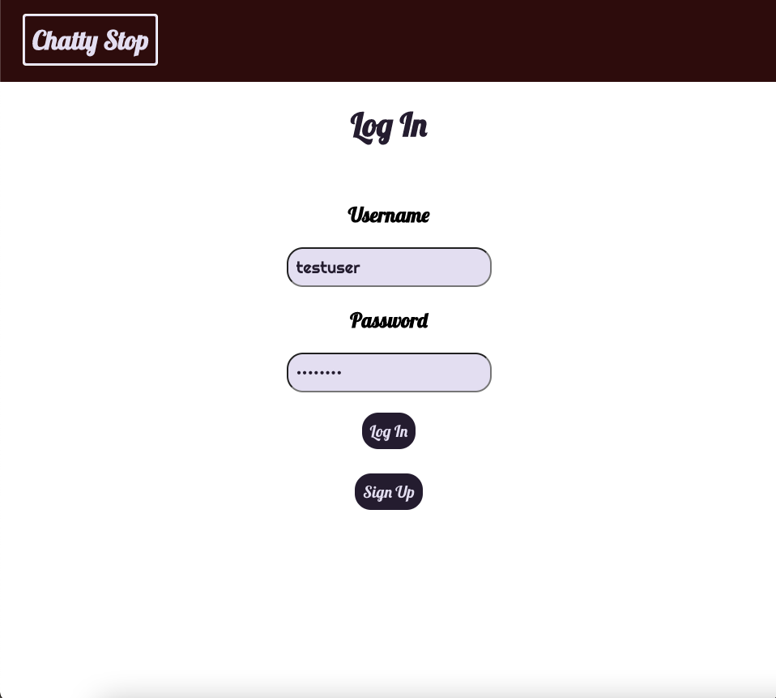
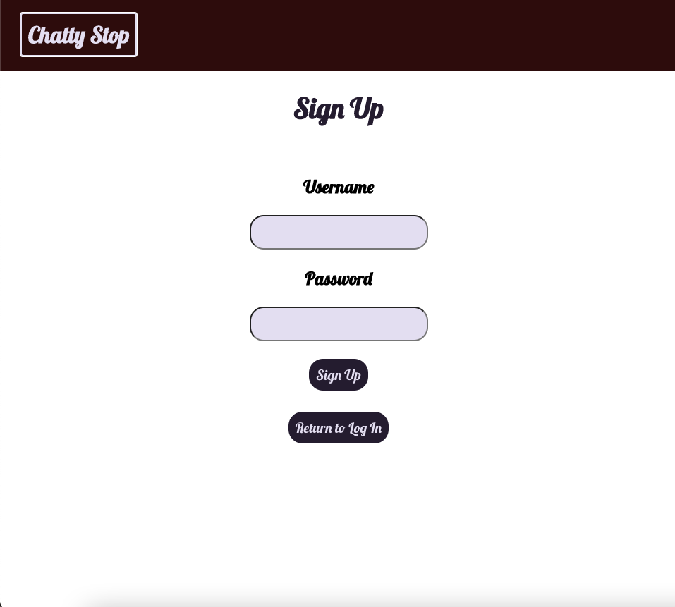
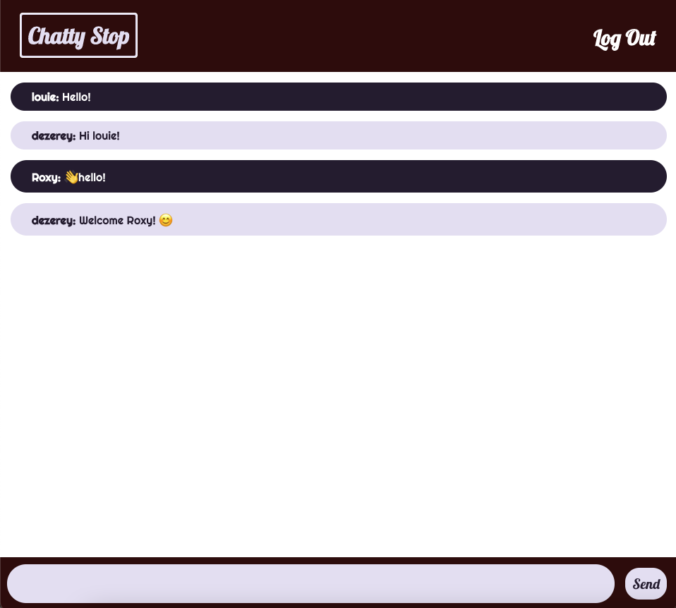

# Chatty Stop

**Authors:** Dezerey Escanuelas

## LINK TO APP

https://de-capstone-project.netlify.app/

## TECHNOLOGIES USED

- HTML
- CSS
- Javascript
- React

## PROJECT SUMMARY

Chatty Stop is an application that allows users to sign in and send messages to other logged in users.

## APPROACH TAKEN

A user is able to see a log in or sign up page when they open the link to the app. When the user signs up, their information is stored in a database. JSON Web Tokens (JWT) were used to authorize the user to be able to send messages while they are logged in. The user can type their message in the input field located at the bottom of the screen and send it by pressing "ENTER" or clicking the "Send" button. By using websockets, the user can send a message to other logged in users instantly without having to run a refresh.

## SCREENSHOTS

## FUTURE UPDATES

- Show when a person connects/disconnects
- Allow the user to change the color of the message if they want to ask a question
- Add a private chat
- Create user pages
- Add/edit profile pictures
